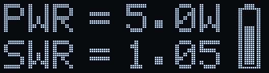
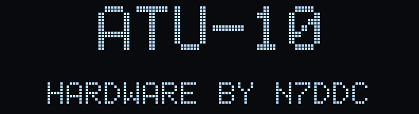
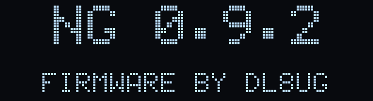
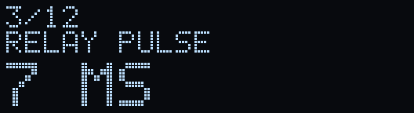
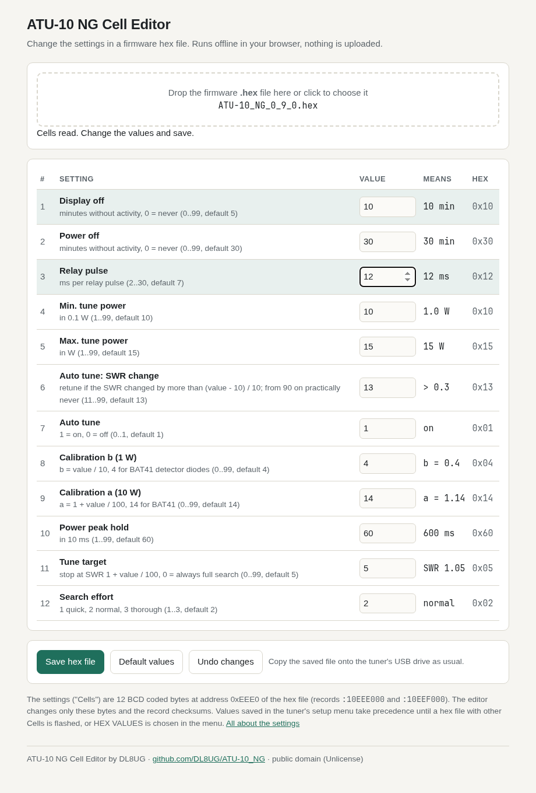

# ATU-10 NG – new firmware for the ATU-10 QRP antenna tuner

A new firmware for the ATU-10 automatic antenna tuner (hardware design by
N7DDC), written from scratch. Its aim is the best possible match and a calm,
stable tuner – not the fastest tune.

**Status: 0.9.2, tested on the device.** See the [timeline](#development-status) below.

## Contents

- [What it does](#what-it-does)
- [Download](#download)
- [Flashing](#flashing)
- [First steps](#first-steps)
- [Operation](#operation)
  - [Button](#button)
  - [Tuning](#tuning)
  - [Display](#display)
  - [LEDs](#leds)
  - [Switching off by itself](#switching-off-by-itself)
  - [External interface](#external-interface)
- [Settings](#settings)
- [Questions](#questions)
- [Development status](#development-status)
- [Feedback](#feedback)
- [License](#license)
- [Credits](#credits)

## What it does

- **Finds the best match, not the first one.** The tuner looks at the whole
  range of relay settings first and then refines the most promising ones. In
  the simulator it reaches the best possible SWR (within 0.05) in practically
  all cases that can be matched at all (over 99.9 %), with random wires, EFHWs, dipoles,
  doublets and more. [How tuning works](docs/TUNING.md)
- **Remembers the last 12 good tunes.** Back on a band you used before, the
  tuner tries the remembered settings first: a band change then takes about
  2 seconds instead of 4 to 5.
- **Bypass** with a short press, and back to the tuned setting.
- **Settings in three ways:** in a menu on the tuner, with an editor in your
  browser, or directly in the hex file.
- **Keeps its setting** after switching off, a reset or a battery change.
- **Can always be updated** over USB, to any other firmware too.

## Download

**Version 0.9.2**: on the
[release page](https://github.com/DL8UG/ATU-10_NG/releases/tag/v0.9.2), or
here in the repository: [`Firmware/ATU-10_NG_0_9_2.zip`](Firmware/ATU-10_NG_0_9_2.zip)
with the hex file `ATU-10_NG_0_9_2.hex` and the license. What is new: see
[its README](Firmware/ATU-10_NG_0_9_2/README.md#changes-since-091).

The previous version 0.9.1 stays available on its
[release page](https://github.com/DL8UG/ATU-10_NG/releases/tag/v0.9.1).

## Flashing

1. Connect the tuner to the computer with a USB cable.
2. A USB drive appears. Copy the `.hex` file onto it.
3. Wait until the tuner restarts and shows the greeting, two pages of 2
   seconds: "ATU-10 / HARDWARE BY N7DDC", then the version "NG 0.9.2 /
   FIRMWARE BY DL8UG".

    

Any other firmware hex file for the ATU-10 can be flashed the same way at any
time – this firmware never blocks the way back.

## First steps

1. Connect the transceiver to the tuner's input and the antenna to its output.
2. Set the transceiver to 2 to 5 W and send a steady carrier (CW key down,
   FM or AM).
3. Press the tuner's button for about ¼ s (long press). The display shows
   TUNE and the best SWR found so far; after a few seconds the relays stop
   clicking and the SWR reached is shown.
4. Stop sending. The tuner keeps the setting – also when switched off – and
   remembers it for the next time on this band.

## Operation

### Button

| Press | Action |
|---|---|
| short press | bypass on / off (back to the tuned setting) |
| long press (¼ s) | tune – send a carrier of 1 to 15 W |
| very long press (2½ s) | switch off; to switch on, hold the button for about 1½ s |
| short or long press while the display is dark | display on (nothing else happens) |
| held while switching on, through the greeting | setup menu (see [Settings](#settings)) |

### Tuning

Tuning needs a steady carrier of 1 to 15 W (settings 4 and 5); 2 to 5 W give
the most exact readings. While tuning, the display shows TUNE and the best SWR
found so far, and the green LED is on. A first tune usually takes 3 to 6
seconds, a tune on a band used before about 2 seconds.

- If no carrier comes within about 15 seconds after the long press, or the
  carrier stops for about 5 seconds during the tune, the tuner shows
  NO POWER. If it had already found something better, it keeps that,
  otherwise everything stays as it was.
- Short carriers work too, e.g. the CW key pressed for a second at a time:
  pauses of up to about 5 seconds are simply waited out, and after a longer
  pause the next tune within a minute goes on with the interrupted search
  instead of starting again.
- A short press during tuning stops it; the tuner keeps the best setting
  found so far (STOP).
- If the transmitter is too strong for the measurement (the detector is
  above its range, from about 14 to 22 W depending on the battery), the
  tune stops after a few dozen relay steps with OVERLOAD.
- If no setting is better than the direct connection and the SWR there is
  above 1.2, the tuner switches the relays off (NO MATCH). At or below 1.2
  the antenna is simply left connected directly, without a message.

**Auto tune:** while you transmit, the tuner tunes again by itself when the
SWR is above 1.2 and has changed by more than 0.3 since the last tune
(settings 6 and 7). It does not do that in bypass, and not within 3 seconds
after a tune, and not again after a tune that changed nothing (STOP,
NO POWER, OVERLOAD) as long as the SWR stays the same. After NO POWER in
the middle of a search, it goes on with the next carrier (SWR above 1.2).

### Display

| Shown | Meaning |
|---|---|
| PWR = 5.0 W | transmit power, with a short peak hold (setting 10) |
| SWR = 1.05 | SWR, measured while transmitting (the last value stays); -.-- until the first measurement |
| BYP | instead of SWR: bypass is on |
| battery symbol | battery charge, 3.0 V empty .. 4.2 V full |
| TUNE | tuning in progress |
| BYPASS / TUNED | after a short press: bypass on / back to the tuned setting |
| NO POWER | no carrier for tuning |
| NO MATCH | nothing better than the direct connection found (SWR above 1.2), the relays are off |
| STOP | tuning stopped by a button press |
| OVERLOAD | too much power for the measurement; a tune stops |
| LOW BATT | battery below 3.4 V: the tuner switches off; also shown at a restart after a voltage drop |
| POWER OFF | the tuner switches off (button held, see [Button](#button)) |
| WDT RST, STACK RST | the firmware restarted itself after a fault (please report it) |

### LEDs

Every 3 seconds a LED blinks briefly and shows the battery: **green** above
3.7 V, **green and red** (yellow) from 3.6 to 3.7 V, **red** below 3.6 V.
While tuning the green LED is on.

### Switching off by itself

Without activity (no transmitting, no button) the display goes dark after 5
minutes and the tuner switches off after 30 minutes (settings 1 and 2, 0 =
never). Transmitting or a button press switches the display on again. The
relays keep their setting while the tuner is off.

### External interface

For a transceiver that controls the tuner through the start and key lines:

| Start line pulled low | Action |
|---|---|
| 20 to 90 ms | bypass on (also while the display is dark) |
| 200 ms or longer, key line free | tune; the tuner holds the key line low while tuning |

## Settings

> **New: all settings can be changed on the tuner itself** – in the setup
> menu, without a computer and without flashing. Changing them in the hex
> file still works, and a browser editor makes that easy.
>
> **All details: [Settings](docs/SETTINGS.md)** – the menu step by step, the
> menu item HEX VALUES, the editor, and the hex file byte by byte with a
> worked checksum example.

| # | Setting | Default |
|---|---|---|
| 1 | Display off after (minutes, 0 = never) | 5 |
| 2 | Power off after (minutes, 0 = never) | 30 |
| 3 | Relay pulse (ms) | 7 |
| 4 | Minimum power for tuning (in 0.1 W) | 1.0 W |
| 5 | Maximum power for tuning (W) | 15 W |
| 6 | Auto tune when the SWR changed by more than (from 9.0 on: practically never) | 0.3 |
| 7 | Auto tune on / off | on |
| 8 | Detector calibration b (1 W) | 4 |
| 9 | Detector calibration a (10 W) | 14 |
| 10 | Power peak hold | 600 ms |
| 11 | Tune target: stop at this SWR (0 = always the full search) | 1.05 |
| 12 | Search effort: 1 quick, 2 normal, 3 thorough | 2 |

**1. Menu on the tuner:** keep the button pressed when switching on, through
the greeting, until SETUP appears. A short press changes the value, a long
press goes to the next setting. After setting 12 come three pages, each
done with a short press:

- **SAVE** – keep the values and leave the menu
- **HEX VALUES** – delete the values saved in the menu; the settings written
  in the hex file (for a published file: the defaults above) apply again.
  The tuned relay setting and the memory of tunes stay. Use it to get back to
  a known state after trying things in the menu.
- **EXIT** – leave without saving

Without a press for a minute the menu ends without saving.

**2. Editor in the browser:** download [`tools/cell-editor.html`](tools/cell-editor.html),
open it (it works offline), load the hex file, change the values, save, then
flash the file.

**3. In the hex file:** the settings are 12 BCD coded bytes ("Cells") at
address 0xEEE0, in the lines starting with `:10EEE000` (settings 1–8) and
`:10EEF000` (9–12). Each setting is a pair of bytes: the value, written with
its decimal digits, and `34`. Example: `07 34` = 7 ms relay pulse. After
changing a line its checksum (last byte) must be corrected – see
[Settings](docs/SETTINGS.md#3-directly-in-the-hex-file); the editor does that
for you.

**Which values apply:** values saved in the menu take precedence over the hex
file – until you flash a hex file with other settings (then those apply) or
choose HEX VALUES in the menu.

## Questions

**The tuner does not find a good match.** Check the power (1 to 15 W) and that
the carrier is steady. Some antennas cannot be matched on some bands (the
display then shows the best that was possible). Search effort 3 (setting 12)
tries harder.

**Tuning takes long.** A first tune usually takes 3 to 6 seconds (rarely up to
15), a tune on a band used before about 2 seconds. Search effort 1 (setting
12) is quicker but finds the best match less often.

**The tuner tunes again and again.** Auto tune reacts to a changing SWR. If
that is not wanted (e.g. with SSB on a critical antenna), switch it off
(setting 7) or raise the threshold (setting 6).

**Which settings are in effect?** See [Settings: which values are in
effect](docs/SETTINGS.md#which-values-are-in-effect). Choosing HEX VALUES in
the setup menu brings back the values of the hex file.

**The display stays dark.** Press the button once. If the display still does
not come on, switch the tuner off and on again.

## Development status

| Date | Version | Status | Content |
|---|---|---|---|
| 2026-10-02 | 0.1.0 | development | complete new firmware: search, memory of 12 tunes, setup menu, Cells editor; simulator and PC tests |
| 2026-10-02 | 0.9.0 | release, tested on the device | first device tests passed; review fixes, display clean-up after tuning |
| 2026-10-02 | 0.9.1 | release, tested on the device | review fixes (auto tune near the minimum power, NO MATCH, tune target 0, bypass pulse during a tune), greeting on two pages, POWER OFF screen |
| 2026-10-02 | 0.9.2 | release, tested on the device | tuning with short carriers (CW key), no auto tune again after STOP, OVERLOAD stops a tune, memory order over many tunes, less current when switched off, display fixes |

More: [Settings in detail](docs/SETTINGS.md) · [How tuning works](docs/TUNING.md) · [Development](docs/DEVELOPMENT.md)

## Feedback

Problems, questions and reports from use on the air are very welcome. Please
report them with a detailed description

- as an [issue here on GitHub](https://github.com/DL8UG/ATU-10_NG/issues), or
- in the groups.io thread [ATU-10 NG firmware](https://groups.io/g/ATU100/topic/atu_10_ng_firmware/121543821).

Please include: the firmware version (shown in the greeting), the antenna and
feed line, band and frequency, transceiver and power, what the display showed
(SWR, messages), what you expected instead, and how to make it happen again.

## License

[Beerware](LICENSE) (SPDX: `Beerware`): do whatever you want with it, as
long as you keep the license notice. If we meet some day, and you think this
stuff is worth it, you can buy me a beer in return.

## Credits

The ATU-10 hardware is a design by David Fainitski, N7DDC. The pin
assignment, the relay pulse sequence, the display initialization and the
5x8 font follow his ATU-10 firmware, which he released into the public
domain. Everything else in this firmware is written anew by DL8UG.

Developed with the help of [Claude Code](https://claude.com/claude-code).
