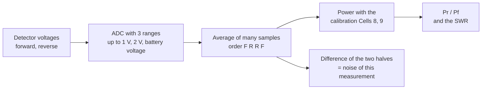
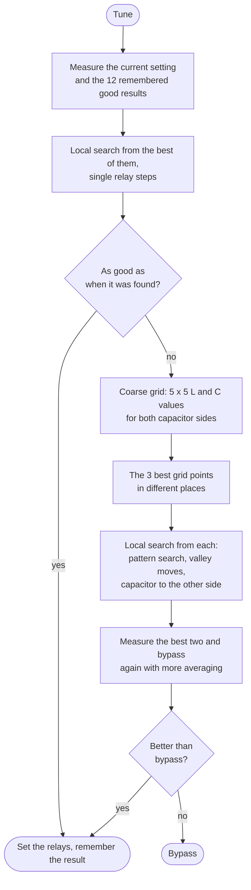

# How tuning works

This page explains how the ATU-10 NG firmware finds the best relay setting,
and how well it does that in the simulator.

## Contents

- [In short](#in-short)
- [The network](#the-network)
- [What the tuner can measure](#what-the-tuner-can-measure)
- [Why tuning is hard](#why-tuning-is-hard)
- [The search](#the-search)
- [Results in the simulator](#results-in-the-simulator)

## In short

- The tuner can set 32768 combinations of coils and capacitors. It cannot try
  them all in a few seconds, and the good ones lie in narrow "valleys".
- So it first looks at a coarse grid of 50 settings spread over the whole
  range, then searches carefully from the 3 most promising places, and
  finally measures the two best results again and compares them with the
  direct connection (bypass).
- Each measurement also tells how noisy it is; a setting only counts as
  better if it is better by more than that noise.
- The last 12 good results are remembered. Back on a band used before, a
  short search from the remembered setting is usually enough (about 2 s).
- In the simulator, with models of many real antennas, the tuner reaches the
  best possible SWR (within 0.05) in practically every case that can be
  matched at all.

Terms used below: **SWR** is the standing wave ratio shown on the display
(1.0 = perfect). **Pf** and **Pr** are the forward and the reflected power;
Pr / Pf is the share of the power that comes back (0 = perfect, 1 = all of
it). **Bypass** means L = 0 and C = 0: the antenna is connected directly.

## The network

The ATU-10 is an L network: a coil bank in series and a capacitor bank in
parallel. A relay (SW) puts the capacitors either on the transmitter side or
on the antenna side.

```
 SW 0: capacitor on the antenna side          SW 1: capacitor on the transmitter side

 TX ──[ L ]──┬── antenna                      TX ──┬──[ L ]── antenna
             │                                     │
            ═╪═ C                                 ═╪═ C
             │                                     │
 GND ────────┴──                              GND ─┴──────────
```

- 7 coil relays: 0.1, 0.22, 0.45, 1.0, 2.2, 4.5, 10 µH (0 .. 18.5 µH, 128 steps)
- 7 capacitor relays: 22, 47, 100, 220, 470, 1000, 2200 pF (0 .. 5 nF, 128 steps)
- with SW: 2 x 128 x 128 = 32768 possible settings

The relays are latching: they keep their setting without power.

## What the tuner can measure

A bridge with two diode detectors gives a voltage for the forward and one for
the reflected wave. The firmware turns them into power with the calibration of
Cells 8 and 9 (P = a·V² + b·V) and computes the share of the power that comes
back, Pr / Pf. That number (the squared reflection coefficient) is what the
search minimizes. Unlike the SWR shown on the display, it does not stop at
9.99, so the search sees a difference between "very bad" and "terrible" too.



The ADC measures small voltages with a 1.024 V reference (1 mV per step),
larger ones with 2.048 V (2 mV per step) and the largest against the battery
voltage. Each measurement is the average of many samples, taken in two halves
(forward, reverse, reverse, forward). The average cancels a slowly changing
carrier. The difference between the halves shows how noisy this particular
measurement is. The firmware uses that to decide whether a setting is really
better or only looks better by chance.

## Why tuning is hard

For each capacitor side the settings that match the antenna form a narrow,
curved valley in the L x C plane. The picture shows the SWR of all 32768
settings for a random wire on 80 m: only a thin band is good. Where few
relays are on, one relay step changes the value a lot (C = 1 → 2 is
32 → 57 pF), and the valley jumps by many steps of the other value.



A search that changes L, then C, then L again easily stops on the slope of
the valley, or finds a small valley and misses the better one.

## The search



1. **Memory (quick retune).** The tuner does not know the frequency. It
   remembers the last 12 good results instead (relay setting and the SWR
   reached, kept in the EEPROM). At the start of a tune it measures them; the
   best one starts a local search with single relay steps. If that
   ends at most 0.05 worse than when the setting was found, the tune is done.
   After a band change to a band used before, this takes about 2 s.
2. **Coarse grid.** L and C at 0, 3, 10, 30 and 90 relay steps (about
   logarithmic), for both capacitor sides: 50 measurements. This finds the
   valleys anywhere, not only the nearest one.
3. **Local search** from the 3 best grid points that are not neighbours of
   each other:
   - *pattern search*: steps in L, in C and diagonally, a quarter of the
     value at first, halved down to single relay steps
   - *valley moves*: one value moved by a big step, then smaller ones, while
     the other value is searched again along its axis. This follows the valley
     floor where it is steep.
   - *capacitor to the other side*: near L = 0 or C = 0 both sides are almost
     the same network, and the better match may be on the other one.
4. **Final check.** The two best results and bypass are measured again with
   more averaging; the better result is set. If it is not clearly better
   than bypass, the tuner goes to bypass.

Every setting is switched and measured only once per tune (a cache of 256
settings), a tune stops after a fixed number of relay steps at the latest,
and a button press stops it at once, leaving the best setting found so far.
If the carrier goes away for longer than the tune waits (about 5 seconds),
the next tune within a minute goes on with the same search: the cache and
the step count are kept, so a chain of such tunes ends like one tune. A
detector above its range at 64 settings in a row stops the tune
(OVERLOAD): a QRP rig delivers more at a strong mismatch, so single
clipped readings only count as bad settings.

Two Cells change the search:

| Cell | Setting | Effect |
|---|---|---|
| 11 | Tune target (default 1.05) | stop as soon as this SWR is reached; 0 = always the full search |
| 12 | Search effort (default 2) | 1 quick (4 x 4 grid, 2 candidates), 2 normal, 3 thorough (7 x 7 grid, 4 candidates, more relay steps) |

## Results in the simulator

The simulator (`Firmware/ATU-10_NG_0_9_2/tools/sim`) runs the firmware's
search and measurement code on a PC against a model of the network, the
bridge, the detectors and the ADC, connected to models of real antennas
(wire antennas as lossy open lines, feed lines, baluns and ununs with their
losses). For every case it also tries all 32768 settings to know the best
possible SWR.

Antenna types, each with several lengths and feed lines, on all bands from
160 to 10 m (3 frequencies per band):

- random wire with 9:1 unun (6 lengths)
- EFHW for 40 m with 49:1 transformer
- resonant dipoles for 80, 40 and 20 m on coax
- dipoles with 1:4 balun at the feed point
- non-resonant dipoles on coax (2 x 7, 2 x 13, 2 x 17 m)
- doublets on 450 / 600 Ohm ladder line with a 1:4 balun at the tuner
- 126 fixed loads from 5 to 2000 Ohm, also reactive

"Matchable" means that the best possible setting reaches SWR 1.5 or better.
Many cases are not matchable at all (e.g. an EFHW on 30 m, or 160 m with a
short wire); there the tuner finds the best that is possible.

| Scenario | Matchable cases | reached SWR ≤ 1.5 | within 0.05 of the best possible | mean tuning time |
|---|---|---|---|---|
| ideal measurement | 768 | 100 % | 100 % | 4.6 s |
| 3 mV ADC noise | 3840 | 100 % | 100 % | 4.6 s |
| hard: noise, unsteady carrier (3 %), QRP rig with 10 Ohm source resistance, 5 % component tolerance, detector calibration off | 3860 | 99.2 % | 99.0 % | 5.1 s |
| small QSY (1 to 3 %) after a tune | 2652 | 100 % | 99.9 % | 2.3 s |
| band changes (20 ↔ 30 m, 40 ↔ 20 m, ...) with the memory filled | 2008 | 100 % | 100 % | 2.2 s (1.8 s after the first round) |

By antenna type (3 mV noise, matchable cases within 0.05 of the best possible):
random wire 100 %, EFHW 100 %, resonant dipoles 100 %, dipoles with 1:4
balun 100 %, non-resonant dipoles 100 %, doublets 100 %, fixed loads 99.8 %.
(100 % is rounded: a single case in a few thousand may miss.)


The tuning time counts relay pulses (3 x Cell 3 plus settling) and the
measurements; the transmitter has to send a carrier for that long.
